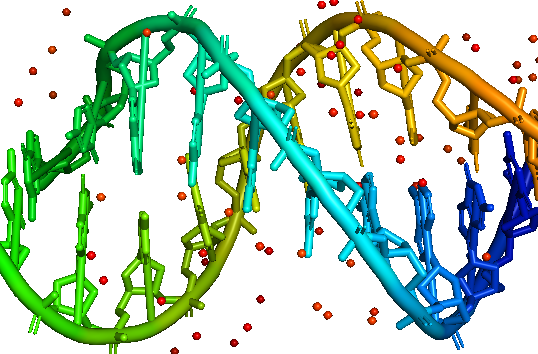

# Static website of Just-DNA-Seq project #

Just DNA-Seq is a set of opensource libraries and pipelines designed to help everybody to:
* annotate your own genome with known longevity and health information ( https://github.com/dna-seq/opencravat-longevity )
* the pipeline to realign your genome and do variant calling with the latest tools ( https://github.com/dna-seq/opencravat-longevity )
* get transparent opensource polygenic health risk predictions
